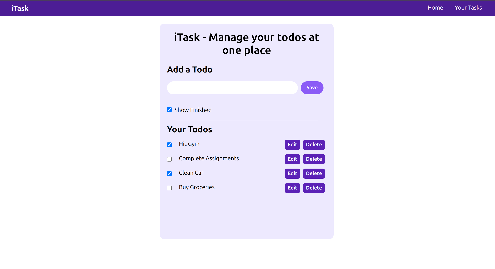

# ✅ iTask - Todo Manager App

<div align="center">
  
</div>

---

## 🔥 Live Preview
👉 https://itodolistapp.netlify.app/

---

# 📖 About The Project

**iTask** is a modern and responsive **Todo Manager Web App** built using **React.js** and **Tailwind CSS**.

The app allows users to:

- Add todos
- Edit existing todos
- Delete todos
- Mark tasks as completed
- Filter completed tasks
- Persist todos using Local Storage

This project focuses on React fundamentals, state management, event handling, and responsive UI design.

---

# 🚀 Features

- ✅ Add Todos
- ✏️ Edit Todos
- 🗑️ Delete Todos
- ☑️ Mark tasks as completed
- 👀 Toggle completed todos visibility
- 💾 Local Storage persistence
- 📱 Responsive design
- ⚡ Fast and interactive UI

---

# 🛠️ Built With

- React.js
- Tailwind CSS
- UUID
- JavaScript (ES6+)
- Vite

---

# 📂 Project Structure

```bash
iTask/
│
├── public/
│
├── src/
│   ├── components/
│   │   └── Navbar.jsx
│   │
│   ├── App.jsx
│   ├── main.jsx
│   └── index.css
│
├── package.json
├── tailwind.config.js
├── vite.config.js
└── README.md
```

---

# ⚙️ Core Functionalities

## ➕ Add Todo

Users can add tasks dynamically.

```javascript
const handleAdd = () => {
  setTodos([...todos, { id: uuidv4(), todo, isCompleted: false }]);
  setTodo("");
};
```

---

## ✏️ Edit Todo

Existing todos can be edited easily.

```javascript
const handleEdit = (e, id) => {
  let t = todos.filter((i) => i.id === id);
  setTodo(t[0].todo);
};
```

---

## 🗑️ Delete Todo

Remove unwanted tasks instantly.

```javascript
const handleDelete = (e, id) => {
  let newTodos = todos.filter((item) => {
    return item.id !== id;
  });

  setTodos(newTodos);
};
```

---

## ☑️ Toggle Completion

Tasks can be marked as completed using checkboxes.

```javascript
newTodos[index].isCompleted = !newTodos[index].isCompleted;
```

---

## 💾 Local Storage Support

Todos remain saved even after refreshing the page.

```javascript
useEffect(() => {
  localStorage.setItem("todos", JSON.stringify(todos));
}, [todos]);
```

---

# 🎨 UI Highlights

- Soft violet theme
- Clean modern layout
- Rounded UI components
- Responsive mobile-friendly design
- Interactive hover effects
- Minimalistic task management interface

---

# 📱 Responsive Design

The application is fully responsive using Tailwind utility classes.

```jsx
className="mx-3 md:container md:mx-auto"
```

---

# 💻 Installation & Setup

## 1️⃣ Clone Repository

```bash
git clone https://github.com/your-username/itask.git
```

---

## 2️⃣ Navigate Into Project

```bash
cd itask
```

---

## 3️⃣ Install Dependencies

```bash
npm install
```

---

## 4️⃣ Start Development Server

```bash
npm run dev
```

---

# 📦 Dependencies Used

## React

```bash
npm install react
```

## UUID

```bash
npm install uuid
```

## Tailwind CSS

```bash
npm install -D tailwindcss postcss autoprefixer
```

---

# 🎯 Learning Outcomes

This project helps in understanding:

- React Hooks
- useState
- useEffect
- Controlled Inputs
- Local Storage API
- Component-Based Architecture
- Dynamic Rendering
- Tailwind CSS Styling
- Event Handling in React

---

# 🔥 Future Improvements

- 🌙 Dark Mode
- 📅 Due Dates
- 🔍 Search Todos
- 🏷️ Categories & Tags
- 📌 Pin Important Tasks
- ☁️ Backend Database Integration
- 🔔 Reminder Notifications

---

# 👩‍💻 Author

Made with ❤️ by **Amisha Patel**

---

# ⭐ Support

If you liked this project:

- Give it a ⭐ on GitHub
- Fork the repository
- Share it with others

---

